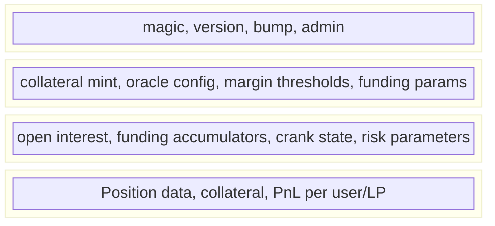

## Overview

The Percolator engine is an open-source Solana program that implements perpetual futures entirely on-chain. Originally created by Solana co-founder [Anatoly Yakovenko](https://x.com/toly) in October 2025, it stores complete market state in a single account called a **slab**.

purple.trade deploys its own instance of the Percolator program and provides a full trading interface on top of it. See the [History](/history) page for the full story of Percolator's origins and Toly's involvement.

## Slab Architecture

A slab is a single Solana account that contains the entire state of one perpetual market:



| Constant | Value |
|----------|-------|
| Slab magic | `0x504552434f4c4154` ("PERCOLAT") |
| Header size | 72 bytes |
| Config size | 320 bytes |
| Account size | 240 bytes |
| Max accounts | 4096 |
| Total slab size | ~992,560 bytes (~6.9 SOL rent) |

One slab = one market = one token. Each token launch creates a new slab.

## Instructions

The Percolator program supports 22 instructions:

| Tag | Instruction | Description |
|-----|-------------|-------------|
| 0 | InitMarket | Create a new slab + vault |
| 1 | InitUser | Register a user account in the slab |
| 2 | InitLP | Create a liquidity provider account |
| 3 | DepositCollateral | Add collateral to a user or LP account |
| 4 | WithdrawCollateral | Remove collateral |
| 5 | TradeCpi | Execute a trade (open/close/increase/decrease) |
| 6 | KeeperCrank | Update the risk engine state |
| 7 | PushOraclePrice | Push a price in authority oracle mode |
| 8 | SetOracleAuthority | Configure the oracle authority |
| 9 | UpdateAdmin | Transfer slab admin |
| 10 | UpdateConfig | Modify market parameters |
| 11 | CloseAccount | Close a user account (withdraw remaining collateral) |
| 12 | SetMatcher | Update the matcher program for an LP |
| 13 | CloseSlab | Close an entire market (admin only) |
| 14–21 | Advanced | Liquidation, settlement, and internal operations |

## PDA Derivation

Two PDA patterns are used:

**Vault authority** (holds the token vault):
```
seeds = ["vault", slab_pubkey]
program = percolator_program_id
```

**LP account** (matcher PDA):
```
seeds = ["lp", slab_pubkey, lp_index_u16_le]
program = percolator_program_id
```

## Oracle Modes

The Percolator supports multiple oracle sources:

| Mode | `indexFeedId` value | How it works |
|------|---------------------|--------------|
| **Authority** | All zeros | Platform pushes price via `PushOraclePrice` instruction |
| **Pyth** | Pyth feed pubkey | Crank reads price from Pyth pull oracle |

purple.trade uses **authority mode** for small-cap tokens that don't have Pyth feeds. The platform pushes prices sourced from DEX aggregators (Meteora pool price, DexScreener).

## Risk Engine

The crank-based risk engine runs checks on every trade:

- **`require_fresh_crank`**: Ensures the crank was updated within `max_crank_staleness_slots`
- **`require_recent_full_sweep`**: For risk-increasing trades, ensures a complete account sweep was recent
- Both return error `0xf` (`EngineUnauthorized`) when stale — this is a freshness error, not a permissions error

The **KeeperCrank** instruction with `callerIdx = 65535` is the permissionless sentinel value, meaning anyone can crank the engine.

The risk engine library ([`percolator`](https://github.com/purpletrade/percolator)) is formally verified using **Kani model checking**, enforcing invariants like:
- **Conservation**: No value created from nothing
- **Isolation**: No cross-account contagion
- **No over-withdrawals**: Users cannot extract more collateral than deposited + PnL

## Collateral Model

Each market uses the **inverted perpetual** model:

- The traded token IS the collateral (no stablecoins, no wrapped assets)
- Price = 1 / token_price (inverted)
- "Long token" = short in the inverted engine
- "Short token" = long in the inverted engine

This means any SPL token can have a perpetual market without needing external liquidity pools or stablecoin pairs.

## Source Code

<CardGroup cols={2}>
  <Card title="percolator-prog" icon="github" href="https://github.com/purpletrade/percolator-prog">
    Core Solana smart contract (~4,400 lines of Rust).
  </Card>
  <Card title="percolator-cli" icon="github" href="https://github.com/purpletrade/percolator-cli">
    CLI for trading, keeper operations, and market management.
  </Card>
  <Card title="percolator-match" icon="github" href="https://github.com/purpletrade/percolator-match">
    Passive LP matcher with 50bps spread.
  </Card>
  <Card title="percolator" icon="github" href="https://github.com/purpletrade/percolator">
    Formally verified risk engine (Kani).
  </Card>
</CardGroup>

purple.trade's SDK has been verified byte-for-byte against the canonical source. See the [Source Verification](/verification) page for the full audit.
