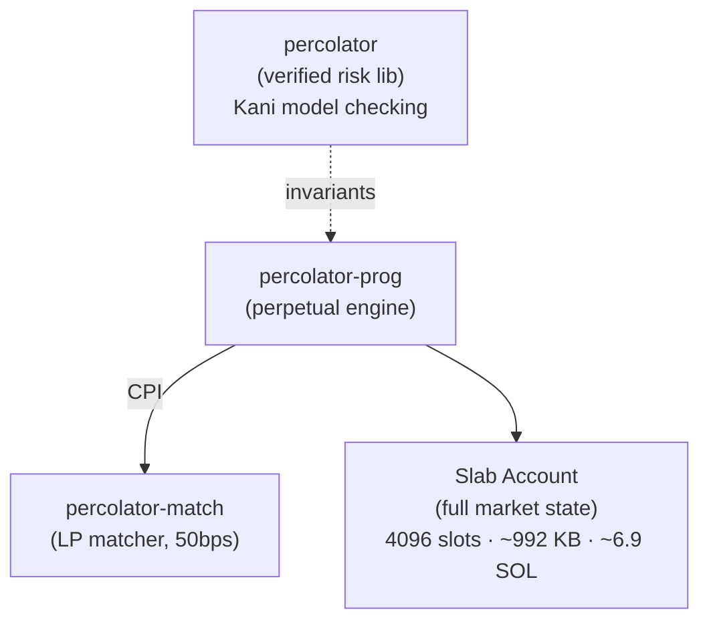

## Repositories

The Percolator protocol consists of four open-source repositories, originally created by Solana co-founder Anatoly Yakovenko and maintained by purple.trade:

<CardGroup cols={2}>
  <Card title="percolator-prog" icon="github" href="https://github.com/purpletrade/percolator-prog">
    Core Solana smart contract — the perpetual futures engine. Single-file Rust program (~4,400 lines) implementing all 22 instructions, slab state management, and risk checks.
  </Card>
  <Card title="percolator-cli" icon="github" href="https://github.com/purpletrade/percolator-cli">
    Command-line interface for account initialization, deposits, withdrawals, trading, and keeper crank operations. Includes stress-test bots. Apache 2.0 licensed.
  </Card>
  <Card title="percolator-match" icon="github" href="https://github.com/purpletrade/percolator-match">
    Passive LP matcher program. Provides liquidity with a 50bps spread via CPI (cross-program invocation) from the main Percolator program.
  </Card>
  <Card title="percolator" icon="github" href="https://github.com/purpletrade/percolator">
    Formally verified risk engine library. Uses Kani model checking for invariants like conservation (no value created from nothing) and isolation (no cross-account contagion) — ensures no over-withdrawals.
  </Card>
</CardGroup>

### Original Source

These repositories are forked from Anatoly Yakovenko's original implementations:

- [`aeyakovenko/percolator-prog`](https://github.com/aeyakovenko/percolator-prog) — Original program source
- [`aeyakovenko/percolator-cli`](https://github.com/aeyakovenko/percolator-cli) — Original CLI

See the [History](/history) page for the full story of Percolator's origins.

## Devnet Deployment

All Percolator programs are currently deployed on Solana **devnet** for testing.

| Component | Address |
|-----------|---------|
| Percolator Program | `2SSnp35m7FQ7cRLNKGdW5UzjYFF6RBUNq7d3m5mqNByp` |
| Matcher Program | `4HcGCsyjAqnFua5ccuXyt8KRRQzKFbGTJkVChpS7Yfzy` |
| Meteora DBC | `dbcij3LWUppWqq96dh6gJWwBifmcGfLSB5D4DuSMaqN` |

<Note>
  Devnet programs are for testing only. Tokens and positions on devnet have no value.
</Note>

### Devnet Explorer Links

- [Percolator Program](https://explorer.solana.com/address/2SSnp35m7FQ7cRLNKGdW5UzjYFF6RBUNq7d3m5mqNByp?cluster=devnet)
- [Matcher Program](https://explorer.solana.com/address/4HcGCsyjAqnFua5ccuXyt8KRRQzKFbGTJkVChpS7Yfzy?cluster=devnet)
- [Meteora DBC](https://explorer.solana.com/address/dbcij3LWUppWqq96dh6gJWwBifmcGfLSB5D4DuSMaqN?cluster=devnet)

## Mainnet Deployment

Both programs are deployed on Solana **mainnet** with upgrade authority retained for security patching, backed by **verified builds** and on-chain `security.txt` metadata.

| Component | Address | Verified Build |
|-----------|---------|----------------|
| Percolator Program | `GFzXiEhiRauw6k59L15zz4UJ9ZANaF5gpPtxEaYCo8jv` | [CI run](https://github.com/purpletrade/percolator-prog/actions/runs/21857175008) |
| Matcher Program | `DHP6DtwXP1yJsz8YzfoeigRFPB979gzmumkmCxDLSkUX` | [CI run](https://github.com/purpletrade/percolator-match/actions/runs/21858415743) |

<Tip>
  Both programs use the Solana Foundation's verifiable build toolchain. The on-chain binary is byte-for-byte reproducible from the open-source code. Explorers that support `security.txt` and verified builds will display green verification badges.
</Tip>

### Why Upgradeable

Rather than making programs immutable, we retain upgrade authority with full transparency:

- **Verified builds** — Every deployment is built deterministically inside `solanafoundation/solana-verifiable-build` Docker containers. CI publishes SHA-256 hashes that anyone can reproduce.
- **security.txt** — Contact information, source repository, and security policy are embedded in the on-chain binary via `solana-security-txt`.
- **Open commit history** — All changes are visible on GitHub. An upstream sync workflow flags any divergence from Anatoly's original source.
- **Formal verification** — 143 Kani proofs validate the risk engine's core safety invariants.

This approach allows us to patch critical bugs and respond to security disclosures while maintaining the same level of verifiability as an immutable program. See the [Source Verification](/verification) page for full details on how to verify the deployed binaries yourself.

### Build Artifacts

| Program | Toolchain | SHA-256 |
|---------|-----------|---------|
| `percolator_prog.so` | Solana 1.18.9 / Rust 1.75.0 | `498f8162...c220` |
| `percolator_match.so` | Solana 2.3.0 | `17ccdb7e...28ae` |

Full hashes and verification instructions on the [Source Verification](/verification#verifiable-builds) page.

### Mainnet Explorer Links

- [Percolator Program](https://explorer.solana.com/address/GFzXiEhiRauw6k59L15zz4UJ9ZANaF5gpPtxEaYCo8jv)
- [Matcher Program](https://explorer.solana.com/address/DHP6DtwXP1yJsz8YzfoeigRFPB979gzmumkmCxDLSkUX)

## Program Architecture

Each perpetual market is a single slab account owned by the Percolator program. The Matcher program handles LP order matching via CPI. The risk engine library provides formally verified invariants that the on-chain program enforces.
