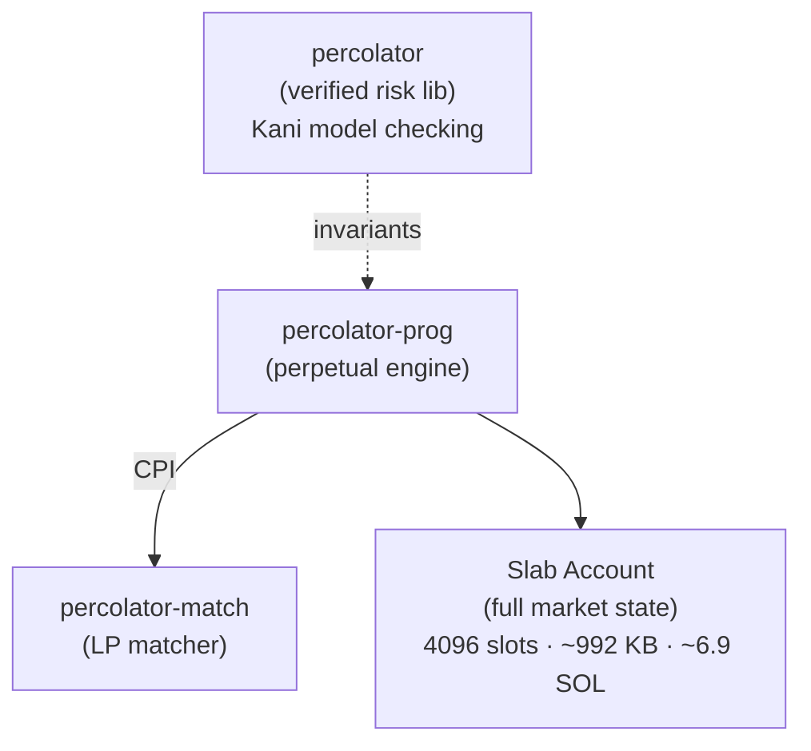

<CardGroup cols={2}>
  <Card title="percolator-prog" icon="github" href="https://github.com/purpletrade/percolator-prog">
    Core perpetual futures engine
  </Card>
  <Card title="percolator-match" icon="github" href="https://github.com/purpletrade/percolator-match">
    Passive LP matcher
  </Card>
  <Card title="percolator-cli" icon="github" href="https://github.com/purpletrade/percolator-cli">
    CLI and operational tooling
  </Card>
  <Card title="percolator" icon="github" href="https://github.com/purpletrade/percolator">
    Formally verified risk engine
  </Card>
</CardGroup>

Forked from Anatoly Yakovenko's original implementations. See [History](/history) for the full story.

---

## Devnet

| Program | Address |
|---------|---------|
| Percolator | [`2SSnp35m7FQ7cRLNKGdW5UzjYFF6RBUNq7d3m5mqNByp`](https://explorer.solana.com/address/2SSnp35m7FQ7cRLNKGdW5UzjYFF6RBUNq7d3m5mqNByp?cluster=devnet) |
| Matcher | [`4HcGCsyjAqnFua5ccuXyt8KRRQzKFbGTJkVChpS7Yfzy`](https://explorer.solana.com/address/4HcGCsyjAqnFua5ccuXyt8KRRQzKFbGTJkVChpS7Yfzy?cluster=devnet) |

<Note>
  Devnet programs are for testing only. Tokens and positions on devnet have no value.
</Note>

## Mainnet

New verified program deployments are in progress. Both programs will be deployed with:

- **Upgrade authority** retained for security patching
- **Verified builds** via [Ellipsis-Labs/solana-verifiable-build](https://github.com/Ellipsis-Labs/solana-verifiable-build) Docker containers
- **`security.txt`** embedded in the on-chain binary ([neodyme-labs/solana-security-txt](https://github.com/neodyme-labs/solana-security-txt))
- Green verification badges on Solana explorers

| Program | Address | Verified Build |
|---------|---------|----------------|
| Percolator | Deploying | [CI run](https://github.com/purpletrade/percolator-prog/actions/runs/21861779506) |
| Matcher | [`MTCPqs6RWWUPMHhvZnnB6BLAXS86TDpTaxQW7Pa3aDh`](https://explorer.solana.com/address/MTCPqs6RWWUPMHhvZnnB6BLAXS86TDpTaxQW7Pa3aDh) | [CI run](https://github.com/purpletrade/percolator-match/actions/runs/21863187116) |

See [Source Verification](/verification) for SHA-256 hashes and instructions to reproduce the build yourself.

---

## Architecture

Each perpetual market is a single slab account owned by the Percolator program. The Matcher handles LP order matching via CPI. The risk engine library provides formally verified invariants that the on-chain program enforces.

See the [Repositories](/repo-percolator-prog) section for detailed documentation on each component.
