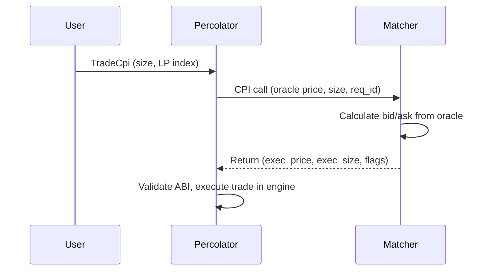

<Info>
  **Repository**: [purpletrade/percolator-match](https://github.com/purpletrade/percolator-match) · **License**: Apache 2.0 · **Language**: Rust
</Info>

## What It Does

`percolator-match` is a Solana program that provides passive market making for Percolator markets. When a user submits a `TradeCpi` instruction, the Percolator program calls this matcher via CPI to determine the execution price and size. The matcher quotes prices around the oracle with a configurable spread.

Deployed on mainnet at [`MTCPqs6RWWUPMHhvZnnB6BLAXS86TDpTaxQW7Pa3aDh`](https://explorer.solana.com/address/MTCPqs6RWWUPMHhvZnnB6BLAXS86TDpTaxQW7Pa3aDh).

## How It Works



The matcher writes its response into a **context account** that Percolator reads after the CPI returns.

## Two Matching Modes

### Passive Mode (kind=0)

Fixed spread around the oracle price. Simple and predictable:

```
bid = floor(oracle_price * 9950 / 10000)   // -50bps
ask = ceil(oracle_price * 10050 / 10000)    // +50bps
```

All integer math, no floating point. Rounding is always passive-favorable (bid rounds down, ask rounds up).

### vAMM Mode (kind=1)

Dynamic pricing with configurable parameters:

| Parameter | Description | Example |
|-----------|-------------|---------|
| `trading_fee_bps` | Fee on every fill | 5 (0.05%) |
| `base_spread_bps` | Minimum spread | 10 (0.10%) |
| `impact_k_bps` | Price impact at full utilization | 100 (1%) |
| `max_total_bps` | Cap on total cost | 500 (5%) |
| `liquidity_notional_e6` | Quoting depth for impact calculation | 10B |
| `max_fill_abs` | Maximum fill per trade | u128::MAX |
| `max_inventory_abs` | Inventory limit (0 = unlimited) | 0 |

Price impact increases with trade size relative to `liquidity_notional_e6`, creating a virtual AMM curve.

## Context Account Layout

Each LP gets a 320-byte context account owned by the matcher program:

| Offset | Size | Field | Description |
|--------|------|-------|-------------|
| 0 | 64 | Return data | ABI response written on each CPI call |
| 64 | 8 | Magic | `0x504552434d415443` ("PERCMATC") |
| 72 | 4 | Version | 3 |
| 76 | 1 | Kind | 0=Passive, 1=vAMM |
| 80 | 32 | LP PDA | Stored on init, verified on every call |
| 112 | 4 | Trading fee bps | |
| ... | ... | (config fields) | |

## Security

- **LP PDA binding** — The matcher verifies the CPI signer matches the stored LP PDA on every call. Prevents unauthorized programs from using the matcher.
- **One-time init** — Context can only be initialized once (no rebinding).
- **Program ownership** — Context account must be owned by the matcher program.
- **Atomic setup required** — Context creation + LP initialization must be in a single transaction to prevent race conditions.

## Instructions

| Tag | Instruction | Description |
|-----|-------------|-------------|
| 0 | Match | Called by Percolator via CPI. Calculates execution price/size. |
| 1 | Init (legacy) | Initialize context with LP PDA. |
| 2 | Init vAMM | Initialize context with LP PDA and full vAMM configuration. |

## Build

```bash
cargo-build-sbf --sbf-out-dir target/deploy -- --locked
cargo test
```

## Verified Build

Built deterministically using `solanafoundation/solana-verifiable-build:2.3.0`. See the [Source Verification](/verification#matcher-program) page for the SHA-256 hash and reproduction instructions.

<CardGroup cols={2}>
  <Card title="View Repository" icon="github" href="https://github.com/purpletrade/percolator-match">
    Source code, context layout, vAMM implementation
  </Card>
  <Card title="Verified Build" icon="shield-check" href="https://github.com/purpletrade/percolator-match/actions/runs/21863835686">
    Latest SBF build artifact with SHA-256 hash
  </Card>
</CardGroup>
