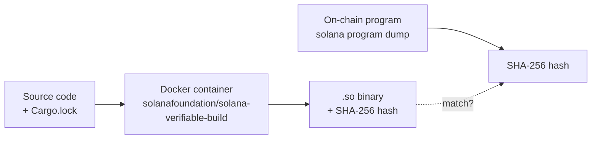

Solana programs are compiled binaries running on-chain. When you interact with a protocol, you're trusting that the deployed binary matches the open-source code you can read. Most protocols ask you to take their word for it.

We don't. Every layer of the Percolator protocol is independently verifiable:

<Steps>
  <Step title="Verifiable builds">
    The exact same Docker container and locked dependencies produce the exact same binary every time. CI publishes the SHA-256 hash — you can reproduce it yourself.
  </Step>
  <Step title="On-chain comparison">
    Dump the deployed program from Solana, hash it, and compare. If the hashes match, the code you read is the code that runs.
  </Step>
  <Step title="SDK audit">
    The TypeScript SDK that builds your transactions has been verified byte-for-byte against the Rust source — every instruction tag, every account ordering, every encoding.
  </Step>
  <Step title="Formal verification">
    143 Kani model-checking proofs verify the risk engine's safety invariants mathematically, not just by testing.
  </Step>
</Steps>

---

## What is an SBF Build?

Solana programs compile to **SBF** (Solana Bytecode Format) — a variant of eBPF designed for the Solana runtime. The compiled `.so` file is what gets deployed on-chain and executed by validators.

The problem: Rust builds are **not deterministic across machines**. Different OS versions, toolchains, or dependency resolution can produce different binaries from the same source code. This means you can't just `cargo build` on your laptop and compare.

The solution: **verifiable builds** use a pinned Docker image with an exact Rust version, exact Solana tools, and a locked `Cargo.lock` to guarantee the same source always produces the same bytes.



If the hashes match, the deployed program is byte-for-byte identical to the open-source code.

---

## Verified Builds

<CardGroup cols={2}>
  <Card title="Percolator Program" icon="shield-check" href="https://github.com/purpletrade/percolator-prog/actions/runs/21861779506">
    Latest CI run — click to see build logs and artifact hash
  </Card>
  <Card title="Matcher Program" icon="shield-check" href="https://github.com/purpletrade/percolator-match/actions/runs/21863187116">
    Latest CI run — click to see build logs and artifact hash
  </Card>
</CardGroup>

### Percolator Program

| | |
|---|---|
| **Repository** | [`purpletrade/percolator-prog`](https://github.com/purpletrade/percolator-prog) |
| **Docker image** | `solanafoundation/solana-verifiable-build:1.18.9` |
| **Rust** | 1.75.0 |
| **Branch** | [`verifiable-build`](https://github.com/purpletrade/percolator-prog/tree/verifiable-build) |
| **Artifact** | `percolator-prog-sbf-1.18.9` (72.5 KB) |
| **SHA-256** | `86dc9dd2bb1fc2b55cf6e7e680821f7d6aef991db5fbabb2c471dbc4ef1305a7` |

### Matcher Program

| | |
|---|---|
| **Repository** | [`purpletrade/percolator-match`](https://github.com/purpletrade/percolator-match) |
| **Docker image** | `solanafoundation/solana-verifiable-build:2.3.0` |
| **Branch** | [`verifiable-build`](https://github.com/purpletrade/percolator-match/tree/verifiable-build) |
| **Artifact** | `percolator-match-sbf-2.3.0` (12.6 KB) |
| **SHA-256** | `d5dd5f2ff1ad464f35a62afc713be1946bd2d6c12d7f8524be8b28e4e6831d4a` |

### What the CI Does

Each verified build workflow runs these steps inside GitHub Actions:

1. **Checkout** — Clone the `verifiable-build` branch with full history
2. **Docker build** — Spin up `solanafoundation/solana-verifiable-build` (pinned version), install the exact Rust toolchain
3. **Compile** — `cargo-build-sbf --force-tools-install --sbf-out-dir target/deploy -- --locked` ensures the `Cargo.lock` is respected exactly
4. **Hash** — `shasum -a 256` produces the deterministic SHA-256 of the `.so` binary
5. **Upload** — The artifact (`.so` + `.sha256`) is published to GitHub Actions for anyone to download

The `--locked` flag is critical — it prevents Cargo from resolving newer dependency versions that could change the output.

### Verify It Yourself

```bash
# Clone and build the percolator program
git clone https://github.com/purpletrade/percolator-prog
cd percolator-prog && git checkout verifiable-build

docker run --rm -v $(pwd):/work -w /work --platform linux/amd64 \
  solanafoundation/solana-verifiable-build:1.18.9 \
  cargo-build-sbf --force-tools-install --sbf-out-dir target/deploy -- --locked

shasum -a 256 target/deploy/percolator_prog.so
# Expected: 86dc9dd2bb1fc2b55cf6e7e680821f7d6aef991db5fbabb2c471dbc4ef1305a7
```

```bash
# Then compare against the on-chain binary
solana program dump <PROGRAM_ID> onchain.so
shasum -a 256 onchain.so
# If these match → the deployed code IS the open-source code
```

A `scripts/verify.sh` helper in the repo does this in one command.

<Tip>
  You can also use [`solana-verify`](https://github.com/Ellipsis-Labs/solana-verifiable-build) for automated verification: `solana-verify verify-from-repo --program-id <ID> --url https://github.com/purpletrade/percolator-prog`
</Tip>

---

## Upstream Transparency

Both repositories include an `upstream-sync.yml` CI workflow that checks for divergence from Anatoly Yakovenko's original source. Every change we make is visible in the commit history:

- [percolator-prog commits](https://github.com/purpletrade/percolator-prog/commits/verifiable-build) — security.txt, vendored dependencies, CI, threat model
- [percolator-match commits](https://github.com/purpletrade/percolator-match/commits/verifiable-build) — vAMM matcher, LP PDA validation, context initialization

## Security Metadata

Both programs embed [`solana-security-txt`](https://github.com/neodyme-labs/solana-security-txt) in the on-chain binary — contact info, source repo, and security policy discoverable directly from explorers like [SolanaFM](https://solana.fm) and [Solscan](https://solscan.io).

Programs with valid `security.txt` and verified builds display green verification badges on supporting Solana explorers.

## Formal Verification

The risk engine ([`purpletrade/percolator`](https://github.com/purpletrade/percolator)) is verified using [Kani model checking](https://model-checking.github.io/kani/) — **143 proofs** that mathematically verify safety invariants:

<CardGroup cols={3}>
  <Card title="Conservation" icon="scale-balanced">
    No value created from nothing. Deposits + insurance = withdrawable capital + positions.
  </Card>
  <Card title="Isolation" icon="shield-halved">
    No cross-account contagion. One account's state cannot corrupt another's.
  </Card>
  <Card title="No Over-Withdrawal" icon="lock">
    Users cannot extract more than deposited capital plus earned PnL.
  </Card>
</CardGroup>

| Category | Proofs | What it verifies |
|----------|--------|-----------------|
| Matcher ABI validation | 13 | Rejects malformed matcher responses |
| Owner/signer enforcement | 5 | Only account owner can act, admin burn disables ops |
| CPI identity binding | 2 | LP matcher program/context must match registration |
| Edge cases & boundaries | 100+ | Overflow, sign, i128::MIN, reserved field checks |

---

## SDK Source Audit

The TypeScript SDK at `src/lib/percolator/` has been verified instruction-by-instruction against the Rust source at [`aeyakovenko/percolator-prog`](https://github.com/aeyakovenko/percolator-prog).

| Category | Verified | Status |
|----------|----------|--------|
| Instruction tags | 21/21 | Verified |
| Data encoding | 21/21 | Verified |
| Account orderings | 21/21 | Verified |
| PDA derivation | 2/2 | Verified |
| Error codes | 25/25 | Verified |
| Slab layout | 4/4 structs | Verified |

<Accordion title="Instruction tags — all 21 match">
| Tag | SDK constant | Rust instruction |
|-----|-------------|-----------------|
| 0 | `IX_TAG.InitMarket` | `InitMarket` |
| 1 | `IX_TAG.InitUser` | `InitUser` |
| 2 | `IX_TAG.InitLP` | `InitLP` |
| 3 | `IX_TAG.DepositCollateral` | `DepositCollateral` |
| 4 | `IX_TAG.WithdrawCollateral` | `WithdrawCollateral` |
| 5 | `IX_TAG.TradeCpi` | `TradeCpi` |
| 6 | `IX_TAG.KeeperCrank` | `KeeperCrank` |
| 7 | `IX_TAG.PushOraclePrice` | `PushOraclePrice` |
| 8 | `IX_TAG.SetOracleAuthority` | `SetOracleAuthority` |
| 9 | `IX_TAG.UpdateAdmin` | `UpdateAdmin` |
| 10 | `IX_TAG.UpdateConfig` | `UpdateConfig` |
| 11 | `IX_TAG.CloseAccount` | `CloseAccount` |
| 12 | `IX_TAG.SetMatcher` | `SetMatcher` |
| 13 | `IX_TAG.CloseSlab` | `CloseSlab` |
| 14 | `IX_TAG.SettleFunding` | `SettleFunding` |
| 15 | `IX_TAG.Liquidate` | `Liquidate` |
| 16 | `IX_TAG.UpdateFundingRate` | `UpdateFundingRate` |
| 17 | `IX_TAG.ReallocSlab` | `ReallocSlab` |
| 18 | `IX_TAG.SetFeeReceiver` | `SetFeeReceiver` |
| 19 | `IX_TAG.WithdrawFees` | `WithdrawFees` |
| 20 | `IX_TAG.ToggleTrading` | `ToggleTrading` |

Tag 21 (`AdminForceCloseAccount`) exists in the Rust source but is intentionally omitted from the SDK as it is an admin-only emergency function.
</Accordion>

<Accordion title="Data encoding — field-by-field match">
Every instruction's data payload verified against the Rust `decode` functions. All little-endian with exact byte offsets:

- `u8`, `u16`, `u32`, `u64`: Standard LE integers
- `i64`, `i128`: Signed integers (twos complement, LE)
- `u128`: 16-byte LE (prices in `PushOraclePrice`)
- `[u8; 32]`: Raw pubkey bytes (`UpdateAdmin`, `SetOracleAuthority`)
</Accordion>

<Accordion title="Account orderings — TradeCpi example">
Each instruction's accounts verified against `process_instruction` in `percolator.rs`. Example for `TradeCpi`:

```
[0] slab (writable)
[1] user (signer)
[2] vault_authority (PDA)
[3] token_vault (writable)
[4] user_token_account (writable)
[5] oracle_account
[6] token_program
[7] matcher_program
[8] lp_pda
```

All 21 instruction account orderings match.
</Accordion>

<Accordion title="PDA derivation — both patterns verified">
**Vault authority:**
```
Rust:   Pubkey::find_program_address(&[b"vault", slab_key.as_ref()], program_id)
SDK:    PublicKey.findProgramAddressSync([Buffer.from("vault"), slab.toBuffer()], programId)
```

**LP PDA:**
```
Rust:   find_program_address(&[b"lp", slab.key.as_ref(), &lp_idx.to_le_bytes()], program_id)
SDK:    PublicKey.findProgramAddressSync([Buffer.from("lp"), slab.toBuffer(), idxBuf], programId)
        where idxBuf = u16 little-endian
```
</Accordion>

<Accordion title="Error codes — 25/27 mapped">
| Code | Error | Mapped |
|------|-------|--------|
| 0 | InvalidInstruction | Yes |
| 1 | InvalidSlabMagic | Yes |
| 2 | InvalidSlabVersion | Yes |
| 3 | InvalidSlabBump | Yes |
| 4 | InvalidSlabLen | Yes |
| 5 | SlabFull | Yes |
| 6 | AccountNotFound | Yes |
| 7 | AccountAlreadyExists | Yes |
| 8 | InsufficientCollateral | Yes |
| 9 | InsufficientMargin | Yes |
| 10 | MaxLeverageExceeded | Yes |
| 11 | InvalidOraclePrice | Yes |
| 12 | OracleStale | Yes |
| 13 | TradingPaused | Yes |
| 14 | Unauthorized | Yes |
| 15 | EngineUnauthorized | Yes |
| 16–25 | (various) | Yes |
| 26 | InvalidConfigParam | Omitted (admin-only) |
| 27 | HyperpTradeNoCpiDisabled | Omitted (internal) |
</Accordion>

<Accordion title="Slab layout — struct offsets verified">
| Struct | Offset | Size | Match |
|--------|--------|------|-------|
| SlabHeader | 0 | 72 bytes | Yes |
| MarketConfig | 72 | 320 bytes | Yes |
| EngineState | 392 | Variable | Yes |
| Account slots | After engine | 240 bytes each | Yes |

Checked against `#[repr(C)]` layout rules with alignment and padding.
</Accordion>

### Methodology

1. Read the complete Rust source (`percolator.rs`, ~4,400 lines)
2. Extract every instruction's decode logic, account ordering, and data format
3. Compare line-by-line against the TypeScript SDK (`instructions.ts`, `accounts.ts`, `slab.ts`, `pda.ts`, `errors.ts`)
4. Confirm byte-level compatibility for all encoded data

---

## Source References

<CardGroup cols={2}>
  <Card title="percolator-prog" icon="github" href="https://github.com/purpletrade/percolator-prog">
    Core program — verified builds, security.txt, formal proofs
  </Card>
  <Card title="percolator-match" icon="github" href="https://github.com/purpletrade/percolator-match">
    LP matcher — verified builds, vAMM implementation
  </Card>
  <Card title="Original source" icon="code-branch" href="https://github.com/aeyakovenko/percolator-prog">
    Canonical source by Anatoly Yakovenko
  </Card>
  <Card title="Risk engine" icon="shield-check" href="https://github.com/purpletrade/percolator">
    Formally verified library — 143 Kani proofs
  </Card>
</CardGroup>
