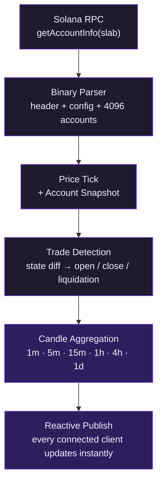
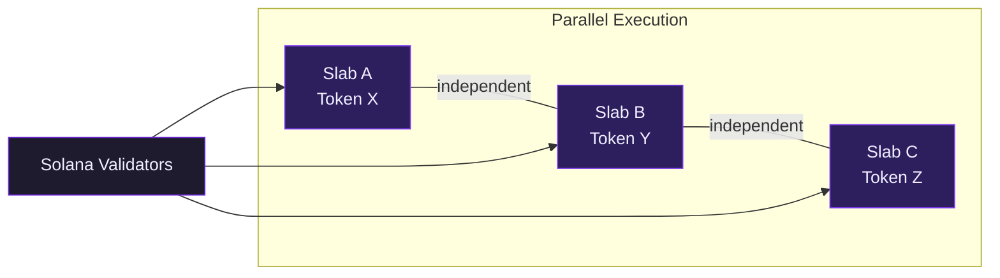
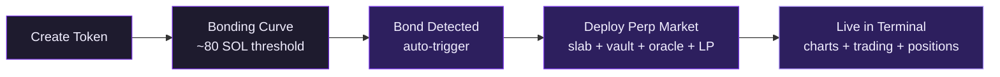

> "A trade button is not a trading platform."

## The Difference

Open-source perpetual futures protocols are public. Anyone can fork the code, deploy a program, and call it a DEX. But a protocol is not a product — the infrastructure between the blockchain and the trader is what makes a platform.

```mermaid
graph LR
    A["Protocol Fork"] -->|"most stop here"| B["Deploy Program"]
    B --> C["Add a UI"]
    C -.->|"purple.trade starts here"| D["Real-Time Backend"]
    D --> E["Live Terminal"]
    E --> F["Auto-Deploy Pipeline"]
    F --> G["Verified & Hardened"]
    style A fill:#1e1b2e,stroke:#6D28D9,color:#9B8FC2
    style B fill:#1e1b2e,stroke:#6D28D9,color:#9B8FC2
    style C fill:#1e1b2e,stroke:#6D28D9,color:#9B8FC2
    style D fill:#2d1f5e,stroke:#7E3AF2,color:#F1EEFF
    style E fill:#2d1f5e,stroke:#7E3AF2,color:#F1EEFF
    style F fill:#2d1f5e,stroke:#7E3AF2,color:#F1EEFF
    style G fill:#2d1f5e,stroke:#7E3AF2,color:#F1EEFF
```

---

## Real-Time Infrastructure

purple.trade runs a **serverless Convex backend** that transforms raw Solana state into a live trading experience. This is the single largest infrastructure investment in the platform — and the layer most forks skip entirely.

### The 10-Second Pipeline

Every 10 seconds, for every active market:

The frontend never polls. Every component — price, chart, position, order book — is a reactive subscriber. When the backend writes, every client receives it instantly.

### Data Architecture

| Layer | Tables | Refresh |
|-------|--------|---------|
| **Market State** | markets, priceTicks, marketStats | 10s |
| **Trading Data** | trades, accountSnapshots, candles (6 timeframes) | 10s |
| **Launch Lifecycle** | launches, volumeAccumulator | Event-driven |
| **Discovery** | Market scan + auto-index | 60s |

<Note>
  This is what separates a trading terminal from a block explorer with a trade button. Without it, you're reading stale state.
</Note>

---

## Scalability

### Slab Isolation

Each perpetual market is a single, independent Solana account. No shared state, no global bottleneck.

| Scale | Backend | Latency |
|-------|---------|---------|
| 10 markets | Baseline | None |
| 100 markets | Linear (serverless) | None — parallel fetches |
| 1,000 markets | Tiered sync, active prioritized | Sub-second for active |

Adding a market means adding an account — not modifying shared state. The Convex backend scales serverlessly. No architectural ceiling.

### Auto-Deploy Pipeline

Any SPL token can have a perpetual market — no curation, no governance vote, no manual listing.

From token creation to leveraged trading — fully automated, no human intervention.

---

## The Terminal

A full trading terminal, not a CLI.

<CardGroup cols={3}>
  <Card title="Order Book" icon="list">
    Positions, LPs, leaderboard, trade history. Live PnL, leverage, liquidation price per entry.
  </Card>
  <Card title="Charts" icon="chart-candlestick">
    Real-time candles across 6 timeframes. Entry and liquidation markers on open positions.
  </Card>
  <Card title="Order Entry" icon="arrow-right-arrow-left">
    Leverage presets, collateral input, real-time simulation of notional, margin, fee, and liquidation before you submit.
  </Card>
</CardGroup>

- **Live PnL** — position value, margin ratio, and liquidation distance update in real time
- **Trade simulation** — see exact notional, margin, and fee at current oracle price before submitting
- **Market browser** — search, sort, and filter by TVL, open interest, position count, or launch date
- **Mobile responsive** — PWA that adapts to any screen, multi-wallet support

---

## Verified and Hardened

Taking an open-source protocol to production means more than deploying it.

<CardGroup cols={2}>
  <Card title="143 Formal Proofs" icon="shield-check">
    Kani model checking on the risk engine — conservation, isolation, and no-over-withdrawal proven mathematically.
  </Card>
  <Card title="Verified Builds" icon="fingerprint">
    Deterministic Docker builds. SHA-256 hashes published. Anyone can reproduce and compare against the on-chain binary.
  </Card>
  <Card title="OtterSec Verified" icon="badge-check">
    Both mainnet programs verified on-chain. Green badges on Solscan.
  </Card>
  <Card title="SDK Audit" icon="magnifying-glass">
    Byte-for-byte verified against Rust source — 21/21 instructions, 25/25 error codes, all PDA derivations.
  </Card>
</CardGroup>

<Card title="Full Verification Details" icon="shield-check" href="/verification">
  SHA-256 hashes, build reproduction instructions, SDK audit tables, and Kani proof breakdown.
</Card>

---

## Production Readiness

| Capability | Status |
|------------|--------|
| Web trading terminal | Live |
| Real-time charts (6 timeframes) | Live |
| Reactive subscriptions (no polling) | Live |
| Automatic trade detection | Live |
| Permissionless markets | Live |
| 10-second data pipeline | Live |
| 143 Kani formal proofs | Verified |
| Deterministic verified builds | Verified |
| OtterSec on-chain verification | Verified |
| Byte-for-byte SDK audit | Verified |
| On-chain security metadata | Embedded |
| Upstream source transparency | CI automated |
| Mobile PWA + multi-wallet | Live |

<Tip>
  Forking a protocol gives you the first row. Everything else is the product.
</Tip>

---

## Start Trading

<CardGroup cols={2}>
  <Card title="Trade Now" icon="chart-line" href="https://purple.trade">
    Open the terminal and trade perpetual futures with up to 10x leverage.
  </Card>
  <Card title="Verify the Code" icon="shield-check" href="/verification">
    Reproduce builds, check hashes, read the SDK audit.
  </Card>
  <Card title="Follow on X" icon="x-twitter" href="https://x.com/tradeonpurple">
    Product updates, new markets, and protocol news.
  </Card>
</CardGroup>
